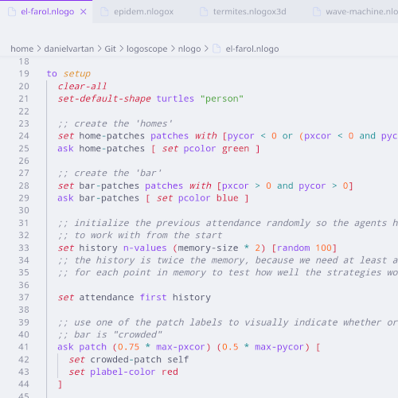

# LogoScope

<!-- badges: start -->
[](https://www.repostatus.org/#active)
[](https://github.com/danielvartan/logoscope/actions/workflows/build.yml)
[](https://marketplace.visualstudio.com/items?itemName=danielvartan.logoscope)
[](https://marketplace.visualstudio.com/items?itemName=danielvartan.logoscope)
[](https://open-vsx.org/extension/danielvartan/logoscope)
[](https://www.gnu.org/licenses/gpl-3.0)
[](CODE_OF_CONDUCT.md)
<!-- badges: end -->

## Overview

`LogoScope` is a Visual Studio Code extension that provides syntax highlighting for the [NetLogo](https://www.netlogo.org/) programming language, covering all NetLogo file extensions (`.nlogo`, `.nlogo3d`, `.nls`, `.nlogox`, `.nlogox3d`). It builds on [akash raj](https://github.com/akashrajkn)'s [NetLogo Syntax Highlighting](https://github.com/akashrajkn/language-netlogo-code) extension that was last updated in 2020.

> If you find this project useful, please consider giving it a star! [](https://github.com/danielvartan/logoscope/)



<sub>Theme: [Catppuccin](https://catppuccin.com/) Latte.</sub>

## Installation

You can install the extension directly from the [Visual Studio Code Marketplace](https://marketplace.visualstudio.com/items?itemName=danielvartan.logoscope) or by searching for `LogoScope` in the extensions panel.

To mannually install the extension, download the latest `.vsix` file from the [releases page](https://github.com/danielvartan/logoscope/releases/latest) and install it by following these steps:

1. Open Visual Studio Code.
2. Go to the Extensions view by clicking on the Extensions icon in the Activity Bar on the side of the window or by pressing `Ctrl+Shift+X`.
3. Click on the three-dot menu in the top-right corner of the Extensions view.
4. Select *Install from VSIX...* from the dropdown menu.
5. Navigate to the location where you downloaded the `.vsix` file, select it, and click *Open*.
6. Follow any prompts to complete the installation.

## How to Contribute

[](CODE_OF_CONDUCT.md)

Contributions are welcome! Whether you want to report bugs, suggest features, or improve the code or documentation, your input is highly valued. Please check the [issues tab](https://github.com/danielvartan/logoscope/issues) for existing issues or to open a new one.

The syntax highlighting is designed to closely match NetLogo's original highlighting. You can use the test files in the `nlogo` folder to evaluate the highlighting accuracy. If you notice any discrepancies or have suggestions for improvement, please don't hesitate to open an issue or submit a pull request.

### Getting Started

1. Clone this repository to yor local machine:

```bash
git clone https://github.com/danielvartan/logoscope
```

2. Open the folder in Visual Studio Code and install all dependencies:

```bash
npm install
```

3. Run the extension in development mode by pressing `F5`.

See the *Useful Resources* section below for more information on developing VS Code extensions.

## License

[](https://www.gnu.org/licenses/gpl-3.0)

```text
Copyright (C) 2025 Daniel Vartanian

{LogoScope} is free software: you can redistribute it and/or modify it under
the terms of the GNU General Public License as published by the Free Software
Foundation, either version 3 of the License, or (at your option) any later
version.

This program is distributed in the hope that it will be useful, but WITHOUT ANY
WARRANTY; without even the implied warranty of MERCHANTABILITY or FITNESS FOR A
PARTICULAR PURPOSE. See the GNU General Public License for more details.

You should have received a copy of the GNU General Public License along with
this program. If not, see <https://www.gnu.org/licenses/>.
```

## Useful Resources

- [NetLogo Dictionary](https://docs.netlogo.org/dictionary.html)
- [NetLogo Programming Guide](https://docs.netlogo.org/7.0.0-beta2/programming.html)
- [TextMate Grammars](https://macromates.com/manual/en/language_grammars)
- [VSCode Extension Manifest](https://code.visualstudio.com/api/references/extension-manifest)
- [VSCode Syntax Highlight Guide](https://code.visualstudio.com/api/language-extensions/syntax-highlight-guide)
- [VSCode Publishing Extensions](https://code.visualstudio.com/api/working-with-extensions/publishing-extension)
- [Positron Extension Template](https://github.com/posit-dev/positron-extension-template)
- [Positron Extension Development Guide](https://positron.posit.co/extension-development.html)
- [vscode-R-syntax](https://github.com/REditorSupport/vscode-R-syntax)

## Acknowledgements

This extension is based on the work of [akash raj](https://github.com/akashrajkn)'s [NetLogo Syntax Highlighting](https://github.com/akashrajkn/language-netlogo-code) extension, last updated in 2020.

`LogoScope` is an independent project with no affiliation to [NetLogo](https://www.netlogo.org/) or its developers.
