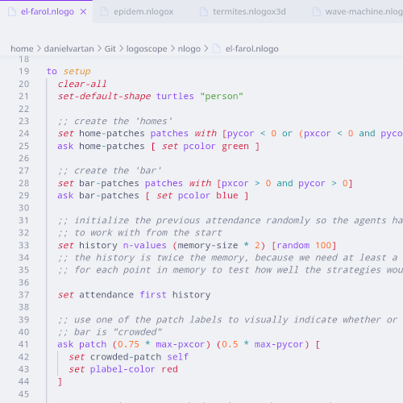

# LogoScope

<!-- badges: start -->
[](https://www.repostatus.org/#active)
[](https://github.com/danielvartan/logoscope/actions/workflows/build.yml)
[](https://marketplace.visualstudio.com/items?itemName=danielvartan.logoscope)
[](https://marketplace.visualstudio.com/items?itemName=danielvartan.logoscope)
[](https://open-vsx.org/extension/danielvartan/logoscope)
[](https://www.gnu.org/licenses/gpl-3.0)
[](https://fairsoftwarechecklist.net/v0.2?f=31&a=30112&i=02322&r=123)
[](https://fair-software.eu)
[](https://www.contributor-covenant.org/version/3/0/code_of_conduct/)
<!-- badges: end -->

## Overview

`LogoScope` is a Visual Studio Code extension that provides syntax highlighting for the [NetLogo](https://www.netlogo.org/) programming language. It supports all NetLogo file extensions (`.nlogo`, `.nlogo3d`, `.nls`, `.nlogox`, `.nlogox3d`) and builds on [akash raj](https://github.com/akashrajkn)'s [NetLogo Syntax Highlighting](https://github.com/akashrajkn/language-netlogo-code) extension, last updated in 2020.

> If you find this project useful, please consider giving it a star! [](https://github.com/danielvartan/logoscope/)

> The continuous development of `LogoScope` depends on community support. If you find this project useful, and can afford to do so, please consider becoming a sponsor. &nbsp; [](https://github.com/sponsors/danielvartan)



<sub>Theme: [Catppuccin](https://catppuccin.com/) Latte.</sub>

## Installation

You can install the extension directly from the [Visual Studio Code Marketplace](https://marketplace.visualstudio.com/items?itemName=danielvartan.logoscope) or by searching for `LogoScope` in the Extensions panel.

To manually install the extension, download the latest `.vsix` file from the code repository [releases page](https://github.com/danielvartan/logoscope/releases/latest) and follow these steps:

1. Open Visual Studio Code.
2. Open the Extensions view (`Ctrl+Shift+X` on Windows/Linux, `Cmd+Shift+X` on macOS).
3. Click the three-dot menu (`...`) in the top-right corner.
4. Select **Install from VSIX...**.
5. Navigate to the downloaded `.vsix` file and click **Open**.

## Contributing

[](https://www.contributor-covenant.org/version/3/0/code_of_conduct/)

Contributions are always welcome! Whether you want to report bugs, suggest new features, or help improve the code or documentation, your input makes a difference.

Before opening a new issue, please check the [issues tab](https://github.com/danielvartan/logoscope/issues) to see if your topic has already been reported.

[](https://github.com/sponsors/danielvartan)


You can also support the development of `LogoScope` by becoming a
sponsor.

Click [here](https://github.com/sponsors/danielvartan) to make a
donation. Please mention `LogoScope` in your donation message.

### Getting Started

To set up the development environment for `LogoScope`, follow these steps:

1. Clone this repository to your local machine:

```bash
git clone https://github.com/danielvartan/logoscope
```

2. Open the folder in Visual Studio Code and install all dependencies:

```bash
npm install
```

3. Run the extension in development mode by pressing `F5`.

The syntax highlighting is designed to closely match NetLogo's original highlighting. You can use the test files in the `models` folder to evaluate highlighting accuracy.

See the [Useful Resources](#useful-resources) section for more information on developing VS Code extensions.

## License

[](https://www.gnu.org/licenses/gpl-3.0)

```text
Copyright (C) 2025 Daniel Vartanian

LogoScope is free software: you can redistribute it and/or modify it under
the terms of the GNU General Public License as published by the Free Software
Foundation, either version 3 of the License, or (at your option) any later
version.

This program is distributed in the hope that it will be useful, but WITHOUT ANY
WARRANTY; without even the implied warranty of MERCHANTABILITY or FITNESS FOR A
PARTICULAR PURPOSE. See the GNU General Public License for more details.

You should have received a copy of the GNU General Public License along with
this program. If not, see <https://www.gnu.org/licenses/>.
```

## Useful Resources

- [NetLogo Dictionary](https://docs.netlogo.org/dictionary.html)
- [NetLogo Programming Guide](https://docs.netlogo.org/7.0.0-beta2/programming.html)
- [TextMate Grammars](https://macromates.com/manual/en/language_grammars)
- [VSCode Extension Development Guide](https://code.visualstudio.com/api/working-with-extensions/publishing-extension)
- [VSCode Extension Manifest](https://code.visualstudio.com/api/references/extension-manifest)
- [VSCode Syntax Highlight Guide](https://code.visualstudio.com/api/language-extensions/syntax-highlight-guide)
- [Positron Extension Development Guide](https://positron.posit.co/extension-development.html)
- [Positron Extension Template](https://github.com/posit-dev/positron-extension-template)
- [R Syntax VScode Extension](https://github.com/REditorSupport/vscode-R-syntax)

## Acknowledgements

This extension is based on the work of [akash raj](https://github.com/akashrajkn)'s [NetLogo Syntax Highlighting](https://github.com/akashrajkn/language-netlogo-code) extension, last updated in 2020.

`LogoScope` is an independent project with no affiliation to [NetLogo](https://www.netlogo.org/) or its developers.

`LogoScope` brand identity is based on the [NetLogo 7](https://www.netlogo.org/) brand identity.
